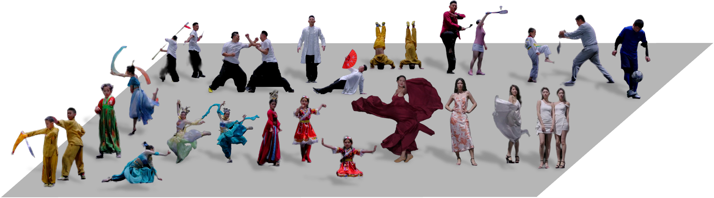

# HiFi-MVHumans

<div align="center">

<h1> A High-Resolution High-Detail Dataset for Human Performance Modeling and Rendering
    
</h1>

<div>
    Peking University
</div>



</div>


## Introduction
- Our HiFi-MVHumans is a versatile human-centric dataset for high-fidelity reconstruction and rendering of human performances from dense multi-view videos. The dataset contains 32 professional players (16 male, 11 females, 5 children), 2 different settings (360-degree panoramic view with 60 cameras, and 270-degree arc with 56 cameras), 4 actions (Dance, Kungfu, Sport, and Fashion Show), 43 sequences and totals around 8.4 million frames of recording.
  
- For the 1080P sequences category, the data is captured indoors in a 360-degree panoramic view roughly 6x6m with 60 calibrated Z CAM E2 cameras. It contains 36 sequences at a resolution of 1920×1080. 

- For the 4K-Studio sequences category, the collecting environment is a uniformly lighted clean indoor stage roughly 6x6m with 56 calibrated Z CAM E2 cameras. The 12 cameras are placed regularly on an arc in front of the stage. 


## Updates
- [08/2023] We release the sample set of HiFi-MVHumans (40\% of the whole data), keeping a hidden testing set for an upcoming challenge. Stay tuned!

## Usage
### The dataset can be directly downloaded from the following links.
HiFi-MVHumans1.0 [OneDrive](https://1drv.ms/f/s!Ak-j_ZC_XxTsgm-incfmvDx-nE0K?e=BuwU5g)

Note again that by downloading the dataset you acknowledge that you have read the agreement, understand it, and agree to be bound by them. If you do not agree with these terms and conditions, you must not download and/or use the Dataset.

### Dataset format
```
.
├── 1080_Dance_Banquet_Single_c23
│   ├── extrinsic.txt
│   ├── intrinsic.txt
│   └── videos
├── 1080_Dance_Dunhuang_Pair_f14f15
│   ├── extrinsic.txt
│   ├── intrinsic.txt
│   └── videos
.
.
. 
├── 4K_Studios_Show_Single_f18
│   ├── extrinsic.txt
│   ├── intrinsic.txt
│   └── videos
└── 4K_Studios_Show_Single_f19
    ├── extrinsic.txt
    ├── intrinsic.txt
    └── videos
```

## Benchmarks
The codebase is coming soon.

## TODO
- [ ] Conduct pilot studies on several tasks.

## Agreement
The HiFi-MVHumans dataset is available for non-commercial research purposes only. Any other use, in particular any use for commercial purposes, is prohibited. This includes, without limitation, incorporation in a commercial product, use in a commercial service, as training data for a commercial product, for commercial ergonomic analysis (e.g. product design, architectural design, etc.), or production of other artifacts for commercial purposes including, for example, web services, movies, television programs, mobile applications, or video games. The dataset may not be used for pornographic purposes or to generate pornographic material whether commercial or not. The Dataset may not be reproduced, modified and/or made available in any form to any third party without Tsinghua University’s prior written permission.

You agree not to reproduce, modified, duplicate, copy, sell, trade, resell or exploit any portion of the images and any portion of derived data in any form to any third party without Tsinghua University’s prior written permission.

You agree not to further copy, publish or distribute any portion of the Dataset. Except, for internal use at a single site within the same organization it is allowed to make copies of the dataset.

Peking University reserves the right to terminate your access to the Dataset at any time.

## License
The HiFi-MVHumans dataset is released under the [CC BY 4.0](https://creativecommons.org/licenses/by/4.0/).

## Contact
- Xiaoyun Zheng (zyun_z@stu.pku.edu.cn)

